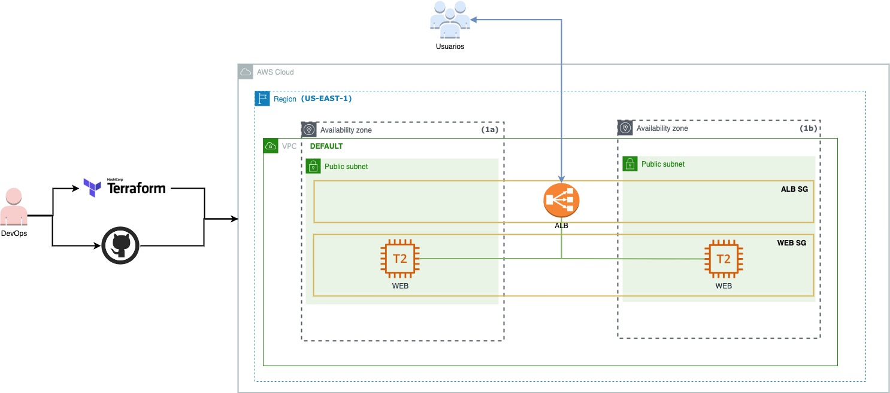

# Challenge 1 Terraform

## Intro
Infraestructura como código (IaC) es una terminología generalizada entre DevOps Profesionales. Es el proceso de administrar y aprovisionar la infraestructura de TI completa (comprende tanto máquinas físicas como virtuales) utilizando archivos de definición legibles por máquina. Es un enfoque de ingeniería de software para las operaciones. Ayuda a automatizar el centro de datos completo mediante el uso de scripts de programación.

Con todas las características que Infraestructura como Código proporciona, tiene múltiples desafíos:

- Necesito aprender a codificar
- No conozco el impacto del cambio.
- Necesito revertir el cambio
- No puedo rastrear cambios
- No se puede automatizar un recurso
- Múltiples entornos para infraestructura
- Terraform ha sido creado para resolver estos desafíos.

Terraform es una poderosa herramienta declarativa que nos ayuda a administrar la gran mayoría de los servicios en la nube, además de brindar consistencia y visibilidad de los cambios de infraestructura que ocurren en diferentes espacios de trabajo y entornos. Esta funcionalidad una pieza importante de mejora a la calidad del ciclo de vida del proyecto, y también mantiene informados a los ingenieros de software y otras personas del mismo equipo.

Al usar Terraform, no necesitamos iniciar sesión en la consola de administración de AWS. Esto reduce el tiempo de creación de servicios. También permite detectar posibles riesgos de seguridad y errores durante una etapa temprana del proyecto.

Con Terraform podemos trabajar directamente desde la terminal de nuestra computadora utilizando un par de líneas de comandos.

## Objetivo

Usted es elegido como DevOps Trainer en una organización cuyo principal foco es automatizar el aprovisionamiento de su infra en AWS.

En esta tarea vamos a desplegar una aplicación (Web) que requiere de dos servidores (AWS EC2) con la ami Amazon Linux en dos zonas de disponibilidad (a y b) por los cuales se van a balancear la carga con (AWS Load Balancer).

- Arquitectura 


## Requisitos
- Crear los recursos con Terraform
- Apuntar el aprovisionamiento a la cuenta Sandbox AWS Academy
- Tipo de instancia: t2.micro
- ami Amazon Linux: ami-0fe472d8a85bc7b0e
- Vpc Default
- Subnet (ayb)
- Security Group servidor ingress TCP [80] egress ALL Trafics ["0.0.0.0/0"]
- Security Group ALB ingress TCP [80] egress ALL Trafics ["0.0.0.0/0"]
- Asociar al recurso del servidor un userdata que contenga un servidor web (apache ó nginx) y que contenga esta página estatica que esta ubicado en este repositorio https://github.com/roxsross/front-devops-github.git

### Tips 
Ejemplo de userdata, ¿Se puede Mejorar?

```
#! /bin/bash
sudo yum update -y
sudo yum install -y zip git
sudo amazon-linux-extras install nginx1 -y
sudo systemctl enable nginx
sudo systemctl start nginx
git clone https://github.com/roxsross/front-devops-github.git
sudo mv front-devops-github/* /usr/share/nginx/html
sudo systemctl restart nginx
```

Muchos Exitos TEAM

¡queremos entender tu forma de pensar! 

> Busca los logros donde no hay límites by @roxsross


## Entrega y Devolución

Con respecto a la entrega, el formato de entrega será subir los archivos de terraform en su versión final en el repositorio de cada estudiante. 
